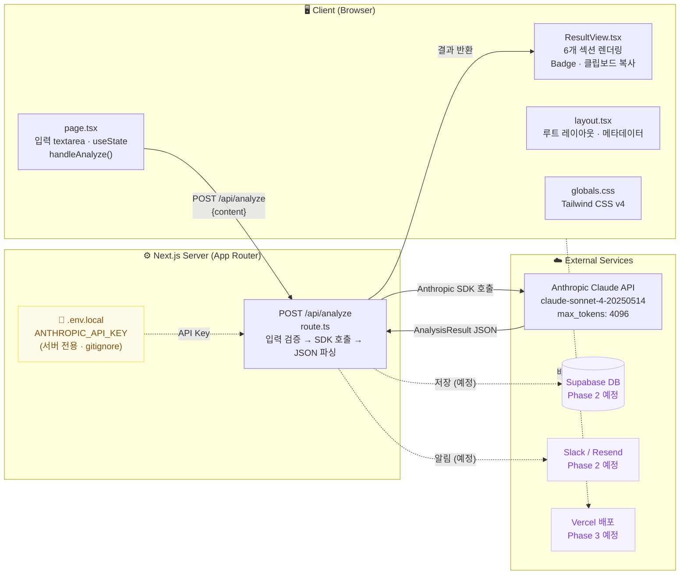
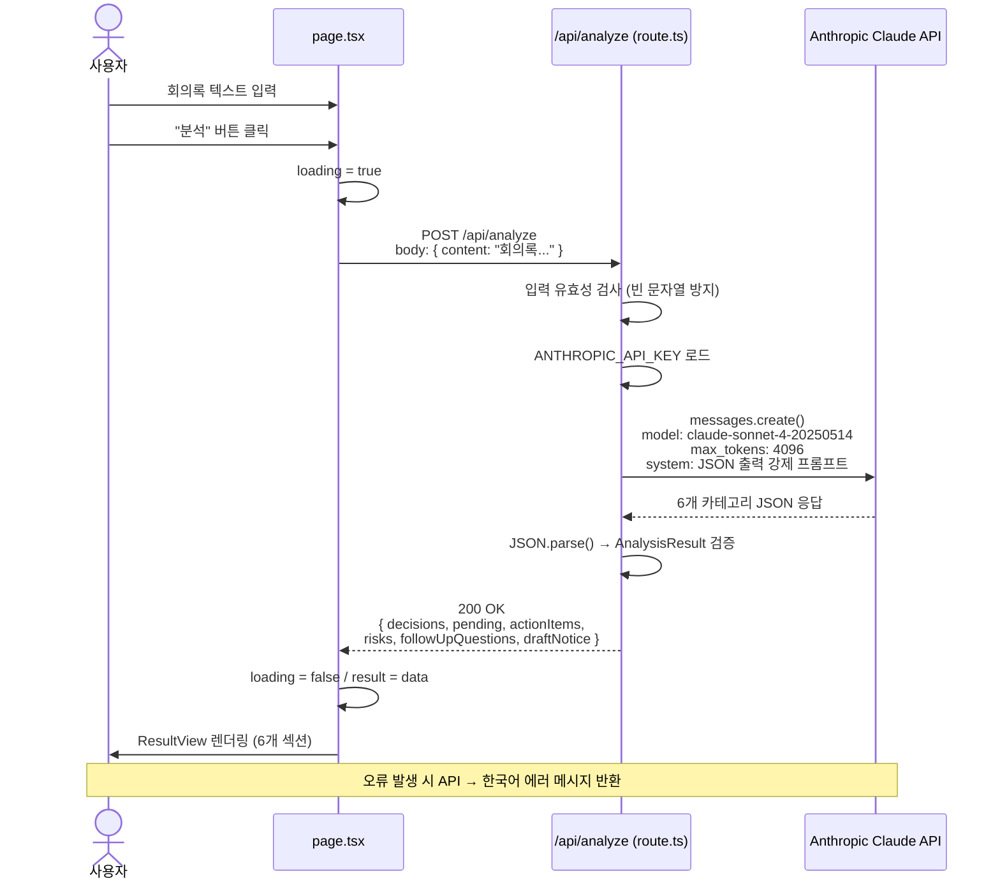
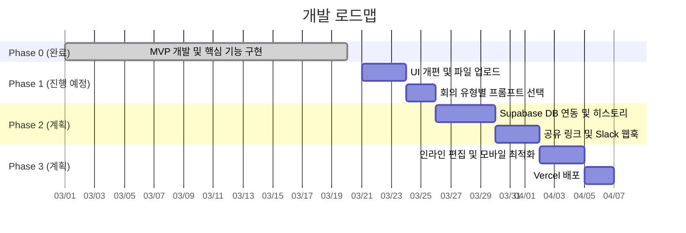

# 시스템 아키텍처

> 회의록 → 실행 항목 변환기 | Next.js 16 + TypeScript + Claude API

---

## 목차

- [개요](#개요)
- [아키텍처 다이어그램](#아키텍처-다이어그램)
- [데이터 흐름](#데이터-흐름)
- [디렉토리 구조](#디렉토리-구조)
- [기술 스택](#기술-스택)
- [API 명세](#api-명세)
- [데이터 인터페이스](#데이터-인터페이스)
- [보안](#보안)
- [개발 로드맵](#개발-로드맵)

---

## 개요

회의록(텍스트)을 입력받아 Claude AI가 6개 카테고리로 자동 분석·정리하는 웹 애플리케이션입니다.
Next.js App Router 기반의 풀스택 구조로, API 키는 서버 사이드에서만 처리하여 클라이언트에 노출되지 않습니다.

---

## 아키텍처 다이어그램



---

## 데이터 흐름



---

## 디렉토리 구조

```
meeting-action-items/
├── app/
│   ├── api/
│   │   └── analyze/
│   │       └── route.ts        # Claude API 연동 엔드포인트
│   ├── components/
│   │   └── ResultView.tsx      # 분석 결과 렌더링 컴포넌트
│   ├── layout.tsx              # 루트 레이아웃 (lang="ko", 메타데이터)
│   ├── page.tsx                # 메인 페이지 (입력 UI · 상태 관리)
│   └── globals.css             # Tailwind CSS 전역 스타일
├── mockups/
│   ├── index.html              # UI 디자인 목업
│   └── preview-uber.html       # 대안 디자인 프리뷰
├── docs/                       # 아키텍처 문서 (이 파일)
├── public/                     # 정적 에셋
├── .env.local                  # 환경변수 (gitignore · 로컬 전용)
├── next.config.ts              # Next.js 설정
├── tsconfig.json               # TypeScript 컴파일 설정 (@/* 별칭)
├── postcss.config.mjs          # PostCSS / Tailwind 설정
├── package.json                # 의존성 · 스크립트
├── PRD.md                      # 제품 요구사항 정의서
├── DEVELOPMENT_PLAN.md         # 개발 로드맵 · 이슈 목록
└── ARCHITECTURE.md             # 이 파일
```

---

## 기술 스택

| 분류 | 기술 | 버전 |
|------|------|------|
| 프레임워크 | Next.js (App Router) | 16.2.0 |
| 언어 | TypeScript | 5.9.3 |
| UI | React | 19.2.4 |
| 스타일링 | Tailwind CSS | 4.2.2 |
| AI/LLM | Anthropic Claude API | SDK 0.80.0 |
| 런타임 | Node.js | 서버 사이드 |

---

## API 명세

### `POST /api/analyze`

회의록 텍스트를 Claude AI로 분석하여 구조화된 결과를 반환합니다.

**Request**

```http
POST /api/analyze
Content-Type: application/json

{
  "content": "오늘 회의에서 논의된 내용..."
}
```

**Response (200 OK)**

```json
{
  "title": "추론된 회의 제목",
  "date": "2026-03-20",
  "decisions": [...],
  "pending": [...],
  "actionItems": [...],
  "risks": [...],
  "followUpQuestions": [...],
  "draftNotice": "..."
}
```

**Error Response (400 / 500)**

```json
{
  "error": "회의 내용을 입력해주세요."
}
```

---

## 데이터 인터페이스

```typescript
interface AnalysisResult {
  title: string;                      // AI가 추론한 회의 제목
  date: string | null;                // AI가 추론한 회의 날짜

  decisions: Array<{
    content: string;                  // 확정된 결정 내용
    importance: "high" | "medium" | "low";
  }>;

  pending: Array<{
    content: string;                  // 미결정 사항
    reason: string;                   // 미결 사유
  }>;

  actionItems: Array<{
    assignee: string;                 // 담당자
    task: string;                     // 할 일
    deadline: string | null;          // 기한
  }>;

  risks: Array<{
    content: string;                  // 리스크 내용
    severity: "high" | "medium" | "low";
  }>;

  followUpQuestions: string[];        // 후속 확인 필요 사항

  draftNotice: string;                // 공지·메일 초안 (바로 발송 가능)
}
```

---

## 보안

| 항목 | 처리 방식 |
|------|-----------|
| API 키 저장 | `.env.local` (로컬 전용, `.gitignore` 포함) |
| API 키 노출 | 서버 사이드 전용 — 클라이언트 번들에 미포함 |
| 입력 검증 | 빈 문자열·null 체크 (서버에서 재검증) |
| 커밋 보안 | `.env*.local` 전체 gitignore 처리 |

> Phase 2 계획: 저장 데이터 암호화, Supabase RLS(Row Level Security), 사용자 인증

---

## 개발 로드맵


