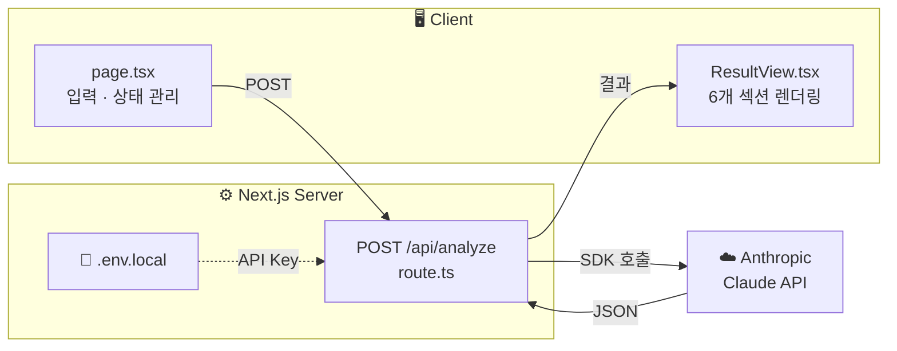

# 회의록 → 실행 항목 변환기

> 회의 녹취·메모를 붙여넣으면 AI가 결정 사항, 할 일, 리스크 등을 자동으로 정리해줍니다.

[](https://nextjs.org/)
[](https://www.typescriptlang.org/)
[](https://tailwindcss.com/)
[](https://www.anthropic.com/)

---

## 주요 기능

AI가 회의록을 분석하여 6개 카테고리로 자동 정리합니다.

| 카테고리 | 설명 |
|----------|------|
| **결정 사항** | 확정된 내용 + 중요도 (high / medium / low) |
| **미결정 사항** | 결론 나지 않은 건 + 미결 사유 |
| **담당자별 할 일** | 누가 / 무엇을 / 언제까지 |
| **일정 리스크** | 지연·위험 요소 + 심각도 |
| **후속 질문** | 추가 확인이 필요한 사항 |
| **공지·메일 초안** | 바로 발송 가능한 요약문 |

---

## 아키텍처



자세한 내용은 [ARCHITECTURE.md](./ARCHITECTURE.md)를 참조하세요.

---

## 시작하기

### 사전 요구사항

- Node.js 18+
- [Anthropic API 키](https://console.anthropic.com/)

### 설치 및 실행

```bash
# 1. 의존성 설치
npm install

# 2. 환경변수 설정
echo "ANTHROPIC_API_KEY=sk-ant-여기에_키_입력" > .env.local

# 3. 개발 서버 실행
npm run dev
```

브라우저에서 [http://localhost:3000](http://localhost:3000) 접속

### 빌드

```bash
npm run build
npm start
```

---

## 기술 스택

| 분류 | 기술 | 버전 |
|------|------|------|
| 프레임워크 | Next.js (App Router) | 16.2.0 |
| 언어 | TypeScript | 5.9.3 |
| UI | React | 19.2.4 |
| 스타일링 | Tailwind CSS | 4.2.2 |
| AI/LLM | Claude (Anthropic SDK) | 0.80.0 |

---

## 프로젝트 구조

```
app/
├── api/analyze/route.ts    # Claude API 엔드포인트
├── components/
│   └── ResultView.tsx      # 결과 렌더링 컴포넌트
├── page.tsx                # 메인 페이지
└── globals.css             # 전역 스타일
```

---

## 개발 로드맵

- [x] **Phase 0** — MVP: 텍스트 입력 → AI 분석 → 결과 표시
- [ ] **Phase 1** — UI 개편, 파일 업로드 (.txt / .docx / .pdf), 회의 유형 선택
- [ ] **Phase 2** — Supabase DB 연동, 히스토리, 공유 링크, Slack 웹훅
- [ ] **Phase 3** — 인라인 편집, 모바일 최적화, Vercel 배포

---

## 문서

- [ARCHITECTURE.md](./ARCHITECTURE.md) — 시스템 아키텍처 · 데이터 흐름 · API 명세
- [PRD.md](./PRD.md) — 제품 요구사항 정의서
- [DEVELOPMENT_PLAN.md](./DEVELOPMENT_PLAN.md) — 개발 계획 · 이슈 목록
